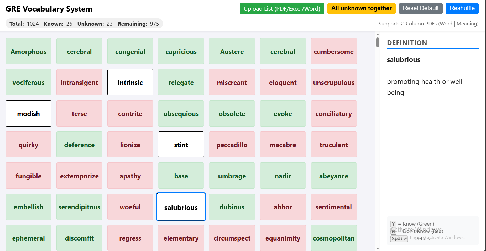
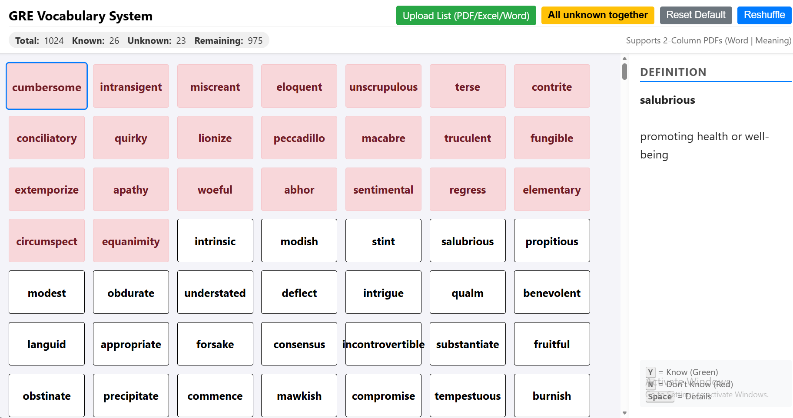

# GRE Vocab Builder 🧠

A lightweight, browser-based vocabulary builder tailored for GRE preparation. Track your progress, sort unknown words, and master your vocabulary efficiently.



[🚀 Live Demo](https://novo-mahmud.github.io/GRE-Vocab-Builder/)

## 💻 Usage Modes

### 1. Online (No Installation)
Access the tool directly via GitHub Pages without downloading anything. Your data is stored in your browser's temporary memory for the session.

👉 [Open Online Version](https://novo-mahmud.github.io/GRE-Vocab-Builder/)

### 2. Offline (Desktop App)
Use the tool entirely offline without internet access.

**Steps to use offline:**
1. Go to the repository page.
2. Click on the `index.html` file.
3. Click the **Download** (Raw) button (usually top-right of the code view).
4. Save the file to your computer.
5. Double-click the downloaded `index.html` file to open it in your default browser (Chrome, Firefox, Edge, etc.).
   *Note: No server or internet connection is required after downloading.*

## ✨ Features

- **Smart Sorting**: 
  - "All Unknown Together" button instantly reorders the list.
  - Priority: Unknown (Red) ➔ Unchecked (White) ➔ Known (Green).
- **Status Tracking**: 
  - Mark words as **Known** (Press `Y`) or **Unknown** (Press `N`).
  - Color-coded feedback for quick visual assessment.
- **Rich Data Display**: 
  - View full definitions and synonyms instantly with a single keypress.
  - Synonyms help build deeper word associations.
- **Import Functionality**: 
  - Upload your own word lists easily.
  - Supports **PDF, Excel (.xlsx), Word (.docx), and CSV** formats.
  - Supports 2-column or 3-column data layouts.
- **Keyboard Shortcuts**: 
  - Designed for speed. Seamlessly navigate using `Y`, `N`, `Spacebar`, and Arrow Keys.

## 🎮 How to Use

1.  **Select a Word**: Click on a word box or use arrow keys.
2.  **Check Knowledge**:
    - Press **Y**: You know the word (Turns Green).
    - Press **N**: You don't know the word (Turns Red).
3.  **View Details**:
    - Press **Spacebar**: Toggle definition and synonyms in the sidebar.
4.  **Sort**:
    - Click the "All unknown together" button to bring red boxes to the top.
    


## 🛠 Tech Stack

This project is built with vanilla web technologies to ensure it runs fast and works in any browser without installation.

- **HTML5 & CSS3**: Structure and responsive styling.
- **JavaScript (ES6+)**: Logic for sorting, keyboard interaction, and state management.
- **External Libraries**:
  - [SheetJS](https://sheetjs.com/): For parsing Excel and CSV files.
  - [PDF.js](https://mozilla.github.io/pdf.js/): For extracting text from PDFs.
  - [Mammoth.js](https://github.com/mwilliamson/mammoth.js): For handling Word documents.

## 📂 Repository Structure

```text
GRE-Vocab-Builder/
│
├── README.md       # This file
└── index.html      # The main application logic and UI
```

## 🤝 Contributing
Feel free to fork this project and submit pull requests for new features or bug fixes!

## 📄 License
This project is open source and available under the MIT License.

## 👨‍💻 Author

### Md. Mahmudul Hasan Novo

Built for Personal GRE Exam Preperation.

LinkedIn: https://www.linkedin.com/in/novo-mahmud

GitHub: https://github.com/novo-mahmud

Email: novomahmud@gmail,com

# Made with ❤️ for GRE students.
